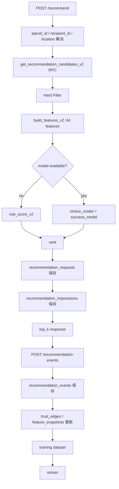

# ShareKeep 安全性考慮型推薦基盤 V2 設計書

作成日: 2026-06-13  
対象リポジトリ: `0ch1a1/58hack2026-6_TeamKouka`  
対象領域: `recommendation-service` / Supabase migration / 推薦ログ / 合成データ / 学習パイプライン

---

## 0. この設計書の結論

ShareKeep の推薦 API は、単に「近い代理人」を並べる API ではなく、**安全性・本人確認・受け渡し場所・荷物リスク・受取人の不安・過去の関係性**を含めて候補を選ぶ推薦基盤として再設計するべきです。

ただし、最初から GNN やグラフDBに行く必要はありません。まずは Postgres / Supabase 上に **関係性ログ = trust edges** を作り、そこから集計特徴量を作る方式で十分にネットワーク推薦らしいことができます。

V2 の方針は以下です。

```text
DB:
  既存テーブルを壊さず、本人確認・代理人文脈・受取人設定・荷物リスク・推薦イベント・関係性ログを追加する

特徴量:
  コア特徴量 48 個 + ネットワーク特徴量 16 個 = 合計 64 個

推論:
  まずは hard filter + rule_score_v2 で実装
  実ログが溜まったら chosen model / success model の2モデルへ移行
  さらにログが溜まったら request_id 単位の learning-to-rank へ移行

合成データ:
  数値特徴量と正解ラベルはプログラムで生成
  生成AIはプロフィール文・レビュー文・キャンセル理由など自然文の生成補助に限定する

UI/API:
  safety_score をそのまま見せない
  ユーザーには badges / reasons / warnings として説明する
```

---

## 1. 現状整理

現状の `recommendation-service` は、Supabase の `get_recommendation_candidates` RPC で候補代理人を取得し、FastAPI + scikit-learn でスコア順に並べる構成です。README でも、学習データは当面合成データで、実ログが溜まったら `recommendation_logs` から再学習する想定、距離は PostGIS の直線距離であることが説明されています。  
参照: [recommendation-service README](https://github.com/0ch1a1/58hack2026-6_TeamKouka/tree/main/recommendation-service)

現状の推薦フローは概ね以下です。

```text
/recommend
  -> 位置を解決
  -> get_recommendation_candidates RPC で近隣代理人を取得
  -> build_features で特徴量化
  -> model.predict でスコアリング
  -> ranked 全件を recommendation_logs に保存
  -> top_k のみレスポンスとして返却
```

`recommendation_logs` は `features`, `score`, `rank`, `model_version`, `chosen`, `outcome` を持ち、`mark_recommendation_chosen` と `record_recommendation_outcome` によって学習ラベルを付ける設計です。  
参照: [recommendation migration](https://raw.githubusercontent.com/0ch1a1/58hack2026-6_TeamKouka/main/supabase/migrations/20260613140000_recommendation.sql)

現状の課題は以下です。

1. **候補だっただけの代理人**と**実際に表示された代理人**が分離されていない。
2. 推薦ログが `recommendation_logs` 1枚に寄っていて、表示・クリック・選択・承認・失敗・通報などの時系列イベントを表現しづらい。
3. 特徴量が距離・時間・実績・レベル・保管負荷・評価寄りで、本人確認、受け渡し場所、荷物リスク、プライバシー不安、関係性ログを十分に扱えていない。
4. 「近いほど良い」という距離スコアが、個人宅や近所の不安と衝突する可能性がある。
5. 顔写真やJPKI確認などの信頼シグナルを扱うDB構造が弱い。
6. 合成データはあるが、V2の推薦シナリオに合わせた世界生成にはなっていない。
7. 推薦の評価指標が AUC 中心になりやすく、ランキング品質を直接測りにくい。

---

## 2. V2 の設計思想

### 2.1 推薦で予測したいもの

ShareKeep が本当に推薦したいのは、単なる「近い人」でも「選ばれやすい人」でもありません。

```text
この荷物を、
この受取人が、
この時間帯に、
この受け渡し場所で、
安心して預けられ、
代理人が受け入れ、
配送と引き取りまで完了しやすい候補
```

したがって推薦スコアは、以下のように分解して考えます。

```text
final_score
= hard_filter
  × weighted_rank_score
  + exploration_bonus
  - privacy_penalty
  - operational_risk_penalty
```

`hard_filter` は、そもそも候補として出してはいけない代理人を落とす層です。  
`weighted_rank_score` は、残った候補を便利さ・安全性・信頼性・相性・負荷分散で並べる層です。

### 2.2 安全性は1つの点数にしない

「顔写真あり」「本人確認済み」「JPKI確認済み」「店舗」「公開カウンター」「過去の成功実績」は、すべて安全性に関係します。  
ただし、これらを単純に `safety_score = 87` のような1つの数字にまとめてユーザーへ表示するのは避けるべきです。

理由は以下です。

- 数字が過信される。
- 何かトラブルが起きた際に説明責任が重くなる。
- 顔写真や本人確認の有無が、ユーザーの心理的・社会的バイアスと結びつきやすい。
- 「安全そうな顔」など、使ってはいけない情報を誘発しやすい。

V2では、管理者・モデル内部ではサブスコアを持ちますが、ユーザー向けには以下の形式にします。

```text
badges:
  - 本人確認済み
  - 顔写真確認済み
  - 店舗受取
  - 公開カウンター
  - この地域で実績あり
  - 保管余裕あり

reasons:
  - 受取可能時間が一致しています
  - 公開カウンターで受け渡しできます
  - このエリアでの完了率が高いです

warnings:
  - 個人宅での受け渡しです
```

### 2.3 顔写真は「顔の中身」を見ない

顔写真は安心材料として有効ですが、推薦モデルが顔の印象を評価してはいけません。  
使う特徴量は以下に限定します。

```text
avatar_present
avatar_verified
liveness_verified
photo_recent_score
```

使わないものは以下です。

```text
顔の印象
年齢らしさ
性別らしさ
表情
美醜
AIが推定した安心感
```

顔写真は「本人性を補強する登録情報がある」という意味で使います。  
「顔が良さそうだから安全」という発想は完全にNGです。

### 2.4 マイナンバーではなく JPKI 確認済みを保存する

DBに `my_number_registered` のようなカラムは作らない方針にします。保存するのはマイナンバーではなく、**JPKI 等で本人確認が完了したという結果**です。

デジタル庁は、JPKI について「マイナンバーカードのICチップに搭載された電子証明書を利用し、マイナンバーは利用しない」本人確認サービスだと説明しています。  
参照: [公的個人認証サービス（JPKI）｜デジタル庁](https://www.digital.go.jp/policies/mynumber/private-business/jpki-introduction)

また、個人情報保護委員会のガイドラインでは、番号法で限定的に明記された場合を除き、他人の個人番号の提供を求めてはならないとされています。  
参照: [特定個人情報の適正な取扱いに関するガイドライン（事業者編）](https://www.ppc.go.jp/legal/policy/my_number_guideline_jigyosha/)

したがって、保存するべき情報は以下です。

```text
identity_assurance_level
jpki_verified
verified_at
expires_at
provider
provider_reference
```

保存しない情報は以下です。

```text
マイナンバーそのもの
マイナンバーカード画像
電子証明書の生データ
本人確認書類の生画像
```

---

## 3. V2 全体アーキテクチャ



---

## 4. DB設計

V2では、既存の `recommendation_logs` をすぐ消すのではなく、まず新テーブルへ移行します。  
旧 `recommendation_logs` は後方互換・比較用に残し、V2 の `/recommend` は新テーブル群に書き込みます。

### 4.1 `user_verifications`

本人確認、電話確認、顔写真確認、JPKI確認、店舗確認などを表します。

```sql
create table if not exists public.user_verifications (
  id uuid primary key default gen_random_uuid(),
  user_id uuid not null references public.profiles(id) on delete cascade,

  method text not null,
  -- email, phone, avatar, liveness, ekyc, jpki, store_license, manual_review

  status text not null default 'pending',
  -- pending, verified, failed, expired, revoked

  assurance_level int not null default 0,
  -- 0: 未確認
  -- 1: email / phone
  -- 2: avatar / liveness
  -- 3: eKYC相当
  -- 4: JPKI等の強い本人確認

  provider text,
  provider_reference text,
  -- 外部本人確認サービスの参照ID。番号や証明書の生データは保存しない。

  verified_at timestamptz,
  expires_at timestamptz,
  metadata jsonb not null default '{}'::jsonb,

  created_at timestamptz not null default now(),

  constraint user_verifications_method_check
    check (method in ('email', 'phone', 'avatar', 'liveness', 'ekyc', 'jpki', 'store_license', 'manual_review')),

  constraint user_verifications_status_check
    check (status in ('pending', 'verified', 'failed', 'expired', 'revoked')),

  constraint user_verifications_assurance_level_check
    check (assurance_level between 0 and 4)
);

create index if not exists idx_user_verifications_user_method_status
  on public.user_verifications(user_id, method, status);

create index if not exists idx_user_verifications_verified
  on public.user_verifications(user_id, assurance_level)
  where status = 'verified';
```

推論時には、以下のような集約ビューを作ると扱いやすいです。

```sql
create or replace view public.user_verification_summary as
select
  user_id,
  max(assurance_level) filter (
    where status = 'verified' and (expires_at is null or expires_at > now())
  ) as identity_assurance_level,
  bool_or(method = 'phone' and status = 'verified') as phone_verified,
  bool_or(method = 'avatar' and status = 'verified') as avatar_verified,
  bool_or(method = 'liveness' and status = 'verified') as liveness_verified,
  bool_or(method = 'jpki' and status = 'verified' and (expires_at is null or expires_at > now())) as jpki_verified,
  bool_or(method = 'store_license' and status = 'verified') as store_verified,
  max(verified_at) as latest_verified_at
from public.user_verifications
group by user_id;
```

### 4.2 `agent_reco_profiles`

代理人タイプ、受け渡し場所、保管能力、対応可能な荷物種別を持ちます。

```sql
create table if not exists public.agent_reco_profiles (
  user_id uuid primary key references public.profiles(id) on delete cascade,

  agent_type text not null default 'individual',
  -- individual, store, community_spot, apartment_manager, delivery_partner

  handover_place_type text not null default 'private_home_door',
  -- private_home_door, building_lobby, store_counter, parcel_locker, public_facility

  is_public_place boolean not null default false,
  is_staffed_place boolean not null default false,

  max_active_parcels int not null default 3,
  current_accepting boolean not null default true,

  accepts_small boolean not null default true,
  accepts_medium boolean not null default true,
  accepts_large boolean not null default false,
  accepts_fragile boolean not null default false,
  accepts_high_value boolean not null default false,
  accepts_cold_storage boolean not null default false,

  storage_security_level int not null default 1,
  -- 1: 通常保管
  -- 2: 施錠可能
  -- 3: 店舗/管理者付き
  -- 4: ロッカー/専用保管

  address_visibility text not null default 'after_assignment',
  -- hidden, approximate, after_assignment

  created_at timestamptz not null default now(),
  updated_at timestamptz not null default now(),

  constraint agent_reco_profiles_agent_type_check
    check (agent_type in ('individual', 'store', 'community_spot', 'apartment_manager', 'delivery_partner')),

  constraint agent_reco_profiles_handover_check
    check (handover_place_type in ('private_home_door', 'building_lobby', 'store_counter', 'parcel_locker', 'public_facility')),

  constraint agent_reco_profiles_capacity_check
    check (max_active_parcels between 1 and 100),

  constraint agent_reco_profiles_storage_level_check
    check (storage_security_level between 1 and 4),

  constraint agent_reco_profiles_address_visibility_check
    check (address_visibility in ('hidden', 'approximate', 'after_assignment'))
);
```

### 4.3 `recipient_reco_preferences`

受取人の不安や好みを表します。

```sql
create table if not exists public.recipient_reco_preferences (
  user_id uuid primary key references public.profiles(id) on delete cascade,

  prefer_store boolean not null default false,
  prefer_public_handover boolean not null default true,
  allow_private_home boolean not null default true,

  privacy_sensitivity int not null default 2,
  -- 1: あまり気にしない
  -- 2: 標準
  -- 3: 近所の個人宅は避けたい
  -- 4: 個人宅NG

  too_close_private_home_threshold_m int not null default 150,

  created_at timestamptz not null default now(),
  updated_at timestamptz not null default now(),

  constraint recipient_privacy_sensitivity_check
    check (privacy_sensitivity between 1 and 4),

  constraint recipient_too_close_threshold_check
    check (too_close_private_home_threshold_m between 0 and 1000)
);
```

### 4.4 `recipient_agent_preferences`

受取人が代理人をお気に入り・ブロックする明示的な関係です。

```sql
create table if not exists public.recipient_agent_preferences (
  recipient_id uuid not null references public.profiles(id) on delete cascade,
  agent_id uuid not null references public.profiles(id) on delete cascade,

  preference_type text not null,
  -- preferred, blocked

  reason_code text,
  created_at timestamptz not null default now(),

  primary key (recipient_id, agent_id, preference_type),

  constraint recipient_agent_preferences_type_check
    check (preference_type in ('preferred', 'blocked'))
);

create index if not exists idx_recipient_agent_preferences_recipient
  on public.recipient_agent_preferences(recipient_id, preference_type);
```

### 4.5 `parcel_risk_profiles`

荷物側のサイズ・重量・リスク・必要本人確認レベルを表します。

```sql
create table if not exists public.parcel_risk_profiles (
  parcel_id uuid primary key references public.parcels(id) on delete cascade,

  size_category text not null default 'small',
  -- small, medium, large

  weight_category text not null default 'light',
  -- light, normal, heavy

  is_fragile boolean not null default false,
  is_high_value boolean not null default false,
  requires_cold_storage boolean not null default false,

  required_identity_level int not null default 1,
  requires_public_handover boolean not null default false,
  required_storage_security_level int not null default 1,

  deadline_at timestamptz,

  created_at timestamptz not null default now(),

  constraint parcel_size_category_check
    check (size_category in ('small', 'medium', 'large')),

  constraint parcel_weight_category_check
    check (weight_category in ('light', 'normal', 'heavy')),

  constraint parcel_required_identity_level_check
    check (required_identity_level between 0 and 4),

  constraint parcel_required_storage_level_check
    check (required_storage_security_level between 1 and 4)
);
```

### 4.6 `recommendation_requests`

推薦1回ごとの親ログです。

```sql
create table if not exists public.recommendation_requests (
  id uuid primary key default gen_random_uuid(),

  parcel_id uuid references public.parcels(id) on delete set null,
  recipient_id uuid references public.profiles(id) on delete set null,

  origin geography(Point, 4326),
  radius_m int not null,
  top_k int not null,
  target_at timestamptz not null,

  model_version text not null,
  feature_schema_version text not null,
  ranking_strategy text not null,
  experiment_id text,

  created_at timestamptz not null default now(),

  constraint recommendation_requests_radius_check
    check (radius_m between 1 and 20000),

  constraint recommendation_requests_top_k_check
    check (top_k between 1 and 50)
);

create index if not exists idx_recommendation_requests_recipient_created
  on public.recommendation_requests(recipient_id, created_at desc);

create index if not exists idx_recommendation_requests_parcel
  on public.recommendation_requests(parcel_id);
```

### 4.7 `recommendation_impressions`

推薦候補として表示された、または候補集合にいた代理人の行です。

重要なのは `candidate_rank`, `shown_rank`, `is_shown` を分けることです。

```sql
create table if not exists public.recommendation_impressions (
  id uuid primary key default gen_random_uuid(),

  request_id uuid not null references public.recommendation_requests(id) on delete cascade,
  agent_id uuid not null references public.profiles(id) on delete cascade,

  candidate_rank int not null,
  shown_rank int,
  is_shown boolean not null default false,

  score double precision not null,
  score_components jsonb not null default '{}'::jsonb,
  features jsonb not null default '{}'::jsonb,

  badges text[] not null default '{}',
  reason_codes text[] not null default '{}',
  warning_codes text[] not null default '{}',

  ineligible boolean not null default false,
  ineligible_reasons text[] not null default '{}',

  created_at timestamptz not null default now(),

  unique(request_id, agent_id),

  constraint recommendation_impressions_rank_check
    check (candidate_rank >= 1),

  constraint recommendation_impressions_shown_rank_check
    check (shown_rank is null or shown_rank >= 1)
);

create index if not exists idx_recommendation_impressions_request
  on public.recommendation_impressions(request_id, candidate_rank);

create index if not exists idx_recommendation_impressions_agent_created
  on public.recommendation_impressions(agent_id, created_at desc);

create index if not exists idx_recommendation_impressions_shown
  on public.recommendation_impressions(is_shown);
```

学習時は、基本的に `is_shown = true` の候補だけを「選ばれなかった負例」として扱います。  
`is_shown = false` の候補は、候補集合分析には使えますが、選択率の負例にしてはいけません。

### 4.8 `recommendation_events`

表示、クリック、選択、代理人承認、拒否、完了、失敗、通報などの時系列イベントです。

```sql
create table if not exists public.recommendation_events (
  id uuid primary key default gen_random_uuid(),

  request_id uuid references public.recommendation_requests(id) on delete cascade,
  impression_id uuid references public.recommendation_impressions(id) on delete set null,
  parcel_id uuid references public.parcels(id) on delete set null,
  agent_id uuid references public.profiles(id) on delete set null,
  recipient_id uuid references public.profiles(id) on delete set null,

  event_type text not null,
  -- shown, clicked, chosen, agent_accepted, agent_rejected,
  -- delivered_to_agent, recipient_picked_up, completed,
  -- cancelled, failed, timeout, complaint, blocked, preferred

  actor_role text,
  -- recipient, agent, driver, system, admin

  reason_code text,
  metadata jsonb not null default '{}'::jsonb,

  created_at timestamptz not null default now(),

  constraint recommendation_events_type_check
    check (event_type in (
      'shown', 'clicked', 'chosen', 'agent_accepted', 'agent_rejected',
      'delivered_to_agent', 'recipient_picked_up', 'completed',
      'cancelled', 'failed', 'timeout', 'complaint', 'blocked', 'preferred'
    )),

  constraint recommendation_events_actor_role_check
    check (actor_role is null or actor_role in ('recipient', 'agent', 'driver', 'system', 'admin'))
);

create index if not exists idx_recommendation_events_request_created
  on public.recommendation_events(request_id, created_at);

create index if not exists idx_recommendation_events_agent_created
  on public.recommendation_events(agent_id, created_at desc);

create index if not exists idx_recommendation_events_recipient_created
  on public.recommendation_events(recipient_id, created_at desc);

create index if not exists idx_recommendation_events_type_created
  on public.recommendation_events(event_type, created_at desc);
```

### 4.9 `trust_edges`

ネットワーク推薦の土台です。グラフDBではなく、Postgres上の関係性ログとして始めます。

```sql
create table if not exists public.trust_edges (
  id uuid primary key default gen_random_uuid(),

  from_type text not null,
  from_id uuid not null,

  to_type text not null,
  to_id uuid not null,

  edge_type text not null,
  -- recipient_completed_with_agent
  -- recipient_failed_with_agent
  -- recipient_preferred_agent
  -- recipient_blocked_agent
  -- agent_served_area
  -- agent_success_with_delivery_company
  -- agent_success_for_parcel_type
  -- review_positive
  -- review_negative

  weight double precision not null default 1.0,
  event_id uuid references public.recommendation_events(id) on delete set null,
  parcel_id uuid references public.parcels(id) on delete set null,

  created_at timestamptz not null default now(),
  expires_at timestamptz,

  constraint trust_edges_weight_check
    check (weight >= -10.0 and weight <= 10.0)
);

create index if not exists idx_trust_edges_from
  on public.trust_edges(from_type, from_id);

create index if not exists idx_trust_edges_to
  on public.trust_edges(to_type, to_id);

create index if not exists idx_trust_edges_type_created
  on public.trust_edges(edge_type, created_at desc);
```

ネットワークのノードは、まず以下を想定します。

```text
Recipient
Agent
AreaCell
Building
DeliveryCompany
ParcelType
HandoverPlace
```

エッジ例です。

```text
Recipient --completed_with--> Agent
Recipient --failed_with--> Agent
Recipient --preferred--> Agent
Recipient --blocked--> Agent
Agent --served--> AreaCell
Agent --success_with--> DeliveryCompany
Agent --success_for--> ParcelType
Agent --belongs_to--> Building
```

### 4.10 feature snapshots

推論時にイベントテーブルを毎回集計すると重いので、時次または日次でスナップショットを作ります。

```sql
create table if not exists public.agent_feature_snapshots (
  agent_id uuid not null references public.profiles(id) on delete cascade,
  snapshot_at timestamptz not null,

  identity_assurance_level int not null default 0,
  phone_verified boolean not null default false,
  avatar_verified boolean not null default false,
  liveness_verified boolean not null default false,
  jpki_verified boolean not null default false,
  store_verified boolean not null default false,

  completed_count_30d int not null default 0,
  completed_count_90d int not null default 0,
  failed_count_30d int not null default 0,
  failed_count_90d int not null default 0,
  cancelled_count_30d int not null default 0,
  complaint_count_90d int not null default 0,

  completion_rate_30d double precision,
  completion_rate_90d double precision,
  cancel_rate_30d double precision,
  complaint_rate_90d double precision,
  response_time_seconds_30d double precision,

  active_load int not null default 0,
  same_slot_load int not null default 0,
  last_seen_at timestamptz,

  unique_recipient_count_90d int not null default 0,
  avg_rating double precision,
  review_count int not null default 0,

  primary key (agent_id, snapshot_at)
);
```

```sql
create table if not exists public.recipient_agent_feature_snapshots (
  recipient_id uuid not null references public.profiles(id) on delete cascade,
  agent_id uuid not null references public.profiles(id) on delete cascade,
  snapshot_at timestamptz not null,

  previous_success_count int not null default 0,
  previous_failure_count int not null default 0,
  is_preferred boolean not null default false,
  is_blocked boolean not null default false,

  primary key (recipient_id, agent_id, snapshot_at)
);
```

```sql
create table if not exists public.area_agent_feature_snapshots (
  area_cell text not null,
  agent_id uuid not null references public.profiles(id) on delete cascade,
  snapshot_at timestamptz not null,

  success_count_30d int not null default 0,
  success_count_90d int not null default 0,
  failure_count_90d int not null default 0,
  completion_rate_90d double precision,
  recent_area_failure_rate double precision,

  primary key (area_cell, agent_id, snapshot_at)
);
```

---

## 5. Hard Filter 設計

ML に入る前に、以下の条件は除外します。  
安全・規約・運用上の絶対条件は、スコアの重みで調整するのではなく、候補から落とします。

| 条件 | 除外理由コード |
|---|---|
| 代理人が受付停止中 | `agent_not_accepting` |
| 代理人がBAN/停止中 | `agent_suspended` |
| 代理人の位置情報がない | `missing_location` |
| 現在の保管数が上限以上 | `capacity_full` |
| 受取人が代理人をブロックしている | `recipient_blocked_agent` |
| 受取人が個人宅NGで、候補が個人宅 | `private_home_not_allowed` |
| 高額荷物なのに本人確認レベル不足 | `identity_level_too_low` |
| 高額荷物なのに高額対応不可 | `high_value_not_supported` |
| 壊れ物なのに壊れ物対応不可 | `fragile_not_supported` |
| 冷蔵が必要なのに冷蔵対応不可 | `cold_storage_not_supported` |
| 大型荷物なのに大型対応不可 | `large_parcel_not_supported` |
| 公開受け渡し必須なのに非公開場所 | `public_handover_required` |
| 必要保管セキュリティレベル不足 | `storage_security_too_low` |
| 直近重大トラブルあり | `recent_serious_incident` |

Python 実装案です。

```python
def check_eligibility(candidate: dict) -> tuple[bool, list[str]]:
    reasons: list[str] = []

    if not candidate.get("current_accepting", True):
        reasons.append("agent_not_accepting")

    if candidate.get("agent_suspended", False):
        reasons.append("agent_suspended")

    if candidate.get("distance_meters") is None:
        reasons.append("missing_location")

    if candidate.get("active_load", 0) >= candidate.get("max_active_parcels", 3):
        reasons.append("capacity_full")

    if candidate.get("recipient_agent_blocked", False):
        reasons.append("recipient_blocked_agent")

    if not candidate.get("recipient_allows_private_home", True):
        if candidate.get("agent_type") == "individual" and candidate.get("handover_place_type") == "private_home_door":
            reasons.append("private_home_not_allowed")

    if candidate.get("parcel_is_fragile", False) and not candidate.get("accepts_fragile", False):
        reasons.append("fragile_not_supported")

    if candidate.get("parcel_is_high_value", False):
        if candidate.get("identity_level", 0) < candidate.get("required_identity_level", 1):
            reasons.append("identity_level_too_low")
        if not candidate.get("accepts_high_value", False):
            reasons.append("high_value_not_supported")

    if candidate.get("requires_cold_storage", False) and not candidate.get("accepts_cold_storage", False):
        reasons.append("cold_storage_not_supported")

    if candidate.get("parcel_size_category") == "large" and not candidate.get("accepts_large", False):
        reasons.append("large_parcel_not_supported")

    if candidate.get("requires_public_handover", False) and not candidate.get("is_public_place", False):
        reasons.append("public_handover_required")

    if candidate.get("storage_security_level", 1) < candidate.get("required_storage_security_level", 1):
        reasons.append("storage_security_too_low")

    if candidate.get("recent_serious_incident", False):
        reasons.append("recent_serious_incident")

    return len(reasons) == 0, reasons
```

---

## 6. 特徴量設計

V2では、コア特徴量48個、ネットワーク特徴量16個、合計64個から始めます。

基本方針です。

```text
- 全特徴量を 0.0〜1.0 に正規化する
- penalty 系も 0.0〜1.0 に揃え、最終スコアで引く
- 欠損時のデフォルトを決める
- 安全上の必須条件は hard filter に寄せる
- 顔写真は有無・検証済みだけを見る
- JPKIは本人確認済みフラグとして扱い、番号は保存しない
```

### 6.1 コア特徴量48個

#### A. 距離・時間・便利さ: 12個

| feature | 意味 | 欠損時 |
|---|---|---|
| `distance_m_norm` | 距離mを正規化 | 1.0 |
| `distance_score` | 近さスコア | 0.0 |
| `route_time_score` | 推定移動時間スコア | `distance_score` で代替 |
| `too_far_penalty` | 遠すぎるペナルティ | 1.0 |
| `same_building` | 同一建物 | 0.0 |
| `same_area_cell` | 同一近隣セル | 0.0 |
| `time_window_match` | 受取可能時間帯一致 | 0.5 |
| `time_window_center_score` | 時間帯の中心に近いか | 0.5 |
| `day_match` | 曜日一致 | 0.5 |
| `is_evening` | 夜間リクエスト | 0.0 |
| `is_weekend` | 週末リクエスト | 0.0 |
| `deadline_urgency_match` | 締切と受付可能性の相性 | 0.5 |

#### B. 安全・本人確認・受渡文脈: 11個

| feature | 意味 | 欠損時 |
|---|---|---|
| `identity_level_norm` | 本人確認レベル0〜4を正規化 | 0.0 |
| `phone_verified` | 電話確認済み | 0.0 |
| `avatar_present` | 顔写真登録あり | 0.0 |
| `avatar_verified` | 顔写真確認済み | 0.0 |
| `liveness_verified` | 生体/ライブネス確認済み | 0.0 |
| `jpki_verified` | JPKI等の強い本人確認済み | 0.0 |
| `store_verified` | 店舗確認済み | 0.0 |
| `account_age_score` | アカウント継続期間 | 0.0 |
| `verification_freshness_score` | 本人確認の新しさ | 0.5 |
| `public_handover_score` | 公開/有人/店舗等の安心度 | 0.0 |
| `private_home_risk_penalty` | 個人宅文脈のリスク | 0.0 |

#### C. 信頼性・品質: 10個

| feature | 意味 | 欠損時 |
|---|---|---|
| `completed_deliveries_score` | 累計完了件数スコア | 0.0 |
| `completion_rate_30d` | 30日完了率 | 0.5 |
| `completion_rate_90d` | 90日完了率 | 0.5 |
| `cancel_rate_30d_inverse` | 30日キャンセル率の逆 | 0.5 |
| `no_show_rate_90d_inverse` | 無応答/未対応率の逆 | 0.5 |
| `avg_rating_score` | 平均評価 | 0.5 |
| `review_count_score` | レビュー件数 | 0.0 |
| `complaint_rate_90d_inverse` | 苦情率の逆 | 0.5 |
| `handover_delay_rate_inverse` | 受け渡し遅延率の逆 | 0.5 |
| `response_time_score` | 応答速度 | 0.5 |

#### D. 保管余力・運用状態: 6個

| feature | 意味 | 欠損時 |
|---|---|---|
| `active_load_ratio_inverse` | 現在保管負荷の逆 | 0.5 |
| `capacity_remaining_score` | 残り容量 | 0.5 |
| `same_slot_load_ratio_inverse` | 同時間帯負荷の逆 | 0.5 |
| `accepts_now` | 現在受付可能 | 0.0 |
| `last_seen_score` | 直近稼働/ログイン | 0.5 |
| `recently_failed_penalty` | 直近失敗ペナルティ | 0.0 |

#### E. 受取人の好み・プライバシー: 5個

| feature | 意味 | 欠損時 |
|---|---|---|
| `recipient_prefers_store_match` | 店舗優先との一致 | 0.5 |
| `recipient_allows_private_home` | 個人宅許容 | 1.0 |
| `recipient_agent_preferred` | お気に入り代理人 | 0.0 |
| `address_visibility_safe` | 住所開示の安全性 | 0.5 |
| `recipient_privacy_sensitivity_match` | 不安感との相性 | 0.5 |

#### F. 荷物との相性: 4個

| feature | 意味 | 欠損時 |
|---|---|---|
| `parcel_size_supported` | サイズ対応 | 0.0 |
| `parcel_weight_supported` | 重量対応 | 0.5 |
| `fragile_supported` | 壊れ物対応 | 0.5 |
| `high_value_requirement_satisfied` | 高額荷物要件を満たす | 0.0 |

### 6.2 ネットワーク特徴量16個

| feature | 意味 | 欠損時 |
|---|---|---|
| `direct_pair_success_score` | 同じ受取人×代理人の成功実績 | 0.0 |
| `direct_pair_failure_penalty` | 同じ受取人×代理人の失敗実績 | 0.0 |
| `area_agent_success_score` | この地域での代理人成功率 | 0.5 |
| `building_agent_success_score` | 同一建物/施設での成功実績 | 0.0 |
| `delivery_company_agent_success_score` | 配送会社×代理人の相性 | 0.5 |
| `parcel_type_agent_success_score` | 荷物種別×代理人の相性 | 0.5 |
| `two_hop_trust_score` | 近隣/共通文脈からの2-hop信頼 | 0.0 |
| `agent_diversity_score` | 複数受取人に使われているか | 0.0 |
| `repeat_usage_score` | リピート利用の健全性 | 0.0 |
| `neighborhood_popularity_score` | 地域での利用実績 | 0.0 |
| `shared_area_density_score` | 同エリア内の関係密度 | 0.0 |
| `recent_area_failure_penalty` | 直近エリア失敗ペナルティ | 0.0 |
| `recipient_segment_agent_success_score` | 似た受取人層での成功率 | 0.5 |
| `reviewer_trust_weighted_score` | 信頼できるレビュアー重み付き評価 | 0.5 |
| `fairness_recent_assignment_penalty` | 直近割当集中ペナルティ | 0.0 |
| `exploration_bonus` | 新規/低露出候補の探索ボーナス | 0.0 |

### 6.3 `FEATURE_NAMES_V2`

```python
FEATURE_NAMES_V2 = [
    # convenience: 12
    "distance_m_norm",
    "distance_score",
    "route_time_score",
    "too_far_penalty",
    "same_building",
    "same_area_cell",
    "time_window_match",
    "time_window_center_score",
    "day_match",
    "is_evening",
    "is_weekend",
    "deadline_urgency_match",

    # safety/context: 11
    "identity_level_norm",
    "phone_verified",
    "avatar_present",
    "avatar_verified",
    "liveness_verified",
    "jpki_verified",
    "store_verified",
    "account_age_score",
    "verification_freshness_score",
    "public_handover_score",
    "private_home_risk_penalty",

    # reliability: 10
    "completed_deliveries_score",
    "completion_rate_30d",
    "completion_rate_90d",
    "cancel_rate_30d_inverse",
    "no_show_rate_90d_inverse",
    "avg_rating_score",
    "review_count_score",
    "complaint_rate_90d_inverse",
    "handover_delay_rate_inverse",
    "response_time_score",

    # operations: 6
    "active_load_ratio_inverse",
    "capacity_remaining_score",
    "same_slot_load_ratio_inverse",
    "accepts_now",
    "last_seen_score",
    "recently_failed_penalty",

    # preference/privacy: 5
    "recipient_prefers_store_match",
    "recipient_allows_private_home",
    "recipient_agent_preferred",
    "address_visibility_safe",
    "recipient_privacy_sensitivity_match",

    # parcel match: 4
    "parcel_size_supported",
    "parcel_weight_supported",
    "fragile_supported",
    "high_value_requirement_satisfied",

    # graph/network: 16
    "direct_pair_success_score",
    "direct_pair_failure_penalty",
    "area_agent_success_score",
    "building_agent_success_score",
    "delivery_company_agent_success_score",
    "parcel_type_agent_success_score",
    "two_hop_trust_score",
    "agent_diversity_score",
    "repeat_usage_score",
    "neighborhood_popularity_score",
    "shared_area_density_score",
    "recent_area_failure_penalty",
    "recipient_segment_agent_success_score",
    "reviewer_trust_weighted_score",
    "fairness_recent_assignment_penalty",
    "exploration_bonus",
]
```

---

## 7. 距離スコアと「近すぎる個人宅は怖い」問題

ShareKeep では、距離は単純に「近いほど良い」ではありません。

```text
店舗・公開カウンター:
  近いほど基本的にプラス

マンション共用部:
  同一建物なら強いプラス

個人宅玄関:
  近すぎる場合、受取人のプライバシー不安が増える可能性

遠すぎる代理人:
  受取コストと再配達削減効果の観点でマイナス
```

したがって、距離特徴量は以下のように分けます。

```text
distance_score:
  基本的な近さ

route_time_score:
  推定徒歩時間/移動時間

too_far_penalty:
  遠すぎる場合のマイナス

private_home_risk_penalty:
  個人宅 + 近すぎる + 受取人のprivacy_sensitivityが高い場合のマイナス
```

実装例です。

```python
def distance_score(distance_m: float) -> float:
    # 0mに近いほど1.0、2000m程度で低下
    if distance_m <= 0:
        return 1.0
    return max(0.0, min(1.0, 1.0 - (distance_m / 2000.0)))


def too_far_penalty(distance_m: float, soft_limit_m: int = 1500, hard_limit_m: int = 5000) -> float:
    if distance_m <= soft_limit_m:
        return 0.0
    if distance_m >= hard_limit_m:
        return 1.0
    return (distance_m - soft_limit_m) / (hard_limit_m - soft_limit_m)


def private_home_risk_penalty(raw: dict) -> float:
    if raw.get("agent_type") != "individual":
        return 0.0
    if raw.get("handover_place_type") != "private_home_door":
        return 0.0

    privacy_sensitivity = int(raw.get("recipient_privacy_sensitivity") or 2)
    distance_m = float(raw.get("distance_meters") or 999999)
    threshold_m = int(raw.get("too_close_private_home_threshold_m") or 150)

    if privacy_sensitivity <= 2:
        return 0.0

    if distance_m >= threshold_m:
        return 0.0

    closeness = 1.0 - max(0.0, distance_m / max(1.0, threshold_m))
    sensitivity_multiplier = {3: 0.6, 4: 1.0}.get(privacy_sensitivity, 0.0)
    return max(0.0, min(1.0, closeness * sensitivity_multiplier))
```

---

## 8. Rule Scorer V2

最初はMLなしでも成立するように、`rule_score_v2` を実装します。  
合成データしかない段階でMLを強くしても、本番で効くとは限らないためです。

```python
def rule_score_v2(features: dict[str, float]) -> dict:
    convenience = (
        0.30 * features["distance_score"]
        + 0.20 * features["route_time_score"]
        + 0.20 * features["time_window_match"]
        + 0.10 * features["time_window_center_score"]
        + 0.10 * features["day_match"]
        + 0.10 * features["deadline_urgency_match"]
    )

    safety = (
        0.22 * features["identity_level_norm"]
        + 0.10 * features["phone_verified"]
        + 0.08 * features["avatar_verified"]
        + 0.08 * features["liveness_verified"]
        + 0.16 * features["jpki_verified"]
        + 0.14 * features["store_verified"]
        + 0.14 * features["public_handover_score"]
        + 0.08 * features["verification_freshness_score"]
    )

    reliability = (
        0.14 * features["completed_deliveries_score"]
        + 0.22 * features["completion_rate_90d"]
        + 0.14 * features["completion_rate_30d"]
        + 0.10 * features["cancel_rate_30d_inverse"]
        + 0.08 * features["no_show_rate_90d_inverse"]
        + 0.10 * features["avg_rating_score"]
        + 0.08 * features["review_count_score"]
        + 0.08 * features["complaint_rate_90d_inverse"]
        + 0.06 * features["response_time_score"]
    )

    operations = (
        0.30 * features["active_load_ratio_inverse"]
        + 0.25 * features["capacity_remaining_score"]
        + 0.15 * features["same_slot_load_ratio_inverse"]
        + 0.15 * features["accepts_now"]
        + 0.15 * features["last_seen_score"]
    )

    preference = (
        0.25 * features["recipient_prefers_store_match"]
        + 0.20 * features["recipient_allows_private_home"]
        + 0.25 * features["recipient_agent_preferred"]
        + 0.15 * features["address_visibility_safe"]
        + 0.15 * features["recipient_privacy_sensitivity_match"]
    )

    parcel_match = (
        0.30 * features["parcel_size_supported"]
        + 0.20 * features["parcel_weight_supported"]
        + 0.20 * features["fragile_supported"]
        + 0.30 * features["high_value_requirement_satisfied"]
    )

    graph = (
        0.12 * features["direct_pair_success_score"]
        + 0.08 * (1.0 - features["direct_pair_failure_penalty"])
        + 0.12 * features["area_agent_success_score"]
        + 0.08 * features["building_agent_success_score"]
        + 0.10 * features["delivery_company_agent_success_score"]
        + 0.08 * features["parcel_type_agent_success_score"]
        + 0.08 * features["two_hop_trust_score"]
        + 0.08 * features["agent_diversity_score"]
        + 0.08 * features["neighborhood_popularity_score"]
        + 0.06 * features["recipient_segment_agent_success_score"]
        + 0.06 * features["reviewer_trust_weighted_score"]
        + 0.06 * features["exploration_bonus"]
    )

    penalty = (
        0.20 * features["too_far_penalty"]
        + 0.30 * features["private_home_risk_penalty"]
        + 0.20 * features["recently_failed_penalty"]
        + 0.15 * features["direct_pair_failure_penalty"]
        + 0.10 * features["recent_area_failure_penalty"]
        + 0.05 * features["fairness_recent_assignment_penalty"]
    )

    score = (
        0.22 * convenience
        + 0.23 * safety
        + 0.22 * reliability
        + 0.10 * operations
        + 0.08 * preference
        + 0.05 * parcel_match
        + 0.10 * graph
        - penalty
    )

    score = max(0.0, min(1.0, score))

    return {
        "score": score,
        "components": {
            "convenience": convenience,
            "safety": safety,
            "reliability": reliability,
            "operations": operations,
            "preference": preference,
            "parcel_match": parcel_match,
            "graph": graph,
            "penalty": penalty,
        },
    }
```

---

## 9. API設計

### 9.1 `POST /recommend` response V2

ユーザー向けには `score_components` を直接出しません。  
代わりに `badges`, `reasons`, `warnings` を返します。

```json
{
  "request_id": "7a3f...",
  "model_version": "rules-v2-20260613",
  "feature_schema_version": "reco-v2-64",
  "generated_at": "2026-06-13T12:00:00+09:00",
  "recommendations": [
    {
      "impression_id": "1bf0...",
      "agent_id": "agent_123",
      "display_name": "駅前クリーニング受付",
      "agent_type": "store",
      "handover_place_type": "store_counter",
      "rank": 1,
      "score": 0.91,
      "distance_meters": 420.0,
      "distance_label": "徒歩約6分",
      "badges": [
        "店舗受取",
        "本人確認済み",
        "この地域で実績あり",
        "保管余裕あり"
      ],
      "reasons": [
        "公開カウンターで受け渡しできます",
        "受取可能時間が一致しています",
        "このエリアでの完了率が高いです"
      ],
      "warnings": []
    }
  ]
}
```

個人宅の場合は以下のような警告を出します。

```json
{
  "display_name": "近隣サポーター",
  "agent_type": "individual",
  "handover_place_type": "private_home_door",
  "badges": ["本人確認済み", "顔写真確認済み", "受取実績あり"],
  "warnings": ["個人宅での受け渡しです"]
}
```

### 9.2 `POST /recommendation-events`

現状の `/feedback` は「選ばれた」だけを扱います。V2ではイベント型にします。

```json
{
  "request_id": "7a3f...",
  "impression_id": "1bf0...",
  "parcel_id": "parcel_123",
  "agent_id": "agent_123",
  "event_type": "chosen",
  "actor_role": "recipient",
  "reason_code": null,
  "metadata": {}
}
```

イベント種類です。

```text
shown
clicked
chosen
agent_accepted
agent_rejected
delivered_to_agent
recipient_picked_up
completed
cancelled
failed
timeout
complaint
blocked
preferred
```

---

## 10. 候補取得RPC V2

現状の `get_recommendation_candidates` は、近接代理人と距離・時間・実績・active_loadなどを返します。V2では、推薦に必要な文脈をまとめて返します。

```sql
create or replace function public.get_recommendation_candidates_v2(
  p_recipient_id uuid,
  p_parcel_id uuid,
  p_lat double precision,
  p_lng double precision,
  p_radius_m integer default 2000,
  p_target_at timestamptz default now()
)
returns table (
  agent_id uuid,
  display_name text,

  distance_meters double precision,
  agent_type text,
  handover_place_type text,
  is_public_place boolean,
  is_staffed_place boolean,

  max_active_parcels int,
  active_load int,
  current_accepting boolean,

  available_days text[],
  start_time time,
  end_time time,

  identity_level int,
  phone_verified boolean,
  avatar_present boolean,
  avatar_verified boolean,
  liveness_verified boolean,
  jpki_verified boolean,
  store_verified boolean,
  latest_verified_at timestamptz,

  completed_deliveries int,
  avg_rating numeric,
  review_count int,

  completion_rate_30d double precision,
  completion_rate_90d double precision,
  cancel_rate_30d double precision,
  complaint_rate_90d double precision,
  response_time_seconds_30d double precision,

  recipient_prefers_store boolean,
  recipient_allows_private_home boolean,
  recipient_privacy_sensitivity int,
  too_close_private_home_threshold_m int,
  recipient_agent_preferred boolean,
  recipient_agent_blocked boolean,

  parcel_size_category text,
  parcel_weight_category text,
  parcel_is_fragile boolean,
  parcel_is_high_value boolean,
  requires_cold_storage boolean,
  required_identity_level int,
  requires_public_handover boolean,
  required_storage_security_level int,

  direct_pair_success_count int,
  direct_pair_failure_count int,
  area_agent_success_rate_90d double precision,
  building_agent_success_count_90d int,
  delivery_company_agent_success_rate_90d double precision,
  parcel_type_agent_success_rate_90d double precision
)
language sql
stable
security definer
set search_path = public
as $$
  -- 実装方針:
  -- 1. target CTE で位置を作る
  -- 2. agent_profiles + agent_reco_profiles + profiles を join
  -- 3. user_verification_summary を join
  -- 4. parcel_risk_profiles を join
  -- 5. recipient_reco_preferences を join
  -- 6. recipient_agent_preferences を preferred / blocked で left join
  -- 7. 最新 agent_feature_snapshots / recipient_agent_feature_snapshots / area_agent_feature_snapshots を join
  -- 8. st_dwithin で半径絞り
  -- 9. 距離順に返す
$$;
```

本番では、候補取得RPCは service_role のみから呼ばれるようにし、クライアントから直接叩かせない方針を維持します。現状のRPCにもPIIが含まれるため、V2でもこの方針は重要です。

---

## 11. 実装ファイル構成

提案する追加・変更ファイルです。

```text
recommendation-service/
  app/
    features.py                    # 既存V1を残す
    features_v2.py                 # 64特徴量
    eligibility.py                 # hard filter
    scoring.py                     # rule_score_v2
    recommendation_service.py      # V2フローへ拡張
    schemas.py                     # V2 schemas追加
    supabase_client.py             # V2 RPC / insert methods追加

  training/
    generate_synthetic.py          # 既存V1を残す
    generate_reco_v2_synthetic.py  # 世界生成型の合成データ
    build_training_frame_v2.py     # events -> train frame
    train.py                       # V1互換を残しつつV2対応
    metrics.py                     # NDCG/MRR/HitRate

supabase/migrations/
  20260613xxxx_recommendation_v2_tables.sql
  20260613xxxx_recommendation_v2_rpc.sql
  20260613xxxx_recommendation_v2_rls.sql
```

---

## 12. 合成データ設計

### 12.1 生成AIで作ってよいもの / 作らないもの

| 区分 | 生成AI利用 | 理由 |
|---|---:|---|
| 代理人プロフィール文 | 可 | デモの自然さを上げられる |
| 店舗紹介文 | 可 | 実データではなく架空文ならOK |
| レビューコメント | 可 | 数値評価とは切り離す |
| キャンセル理由の自然文 | 可 | reason_code の補助テキストに限定 |
| サポート問い合わせ文 | 可 | NLPデモ用途ならOK |
| 正解ラベル | 不可 | LLMバイアスが混入する |
| 安全度ラベル | 不可 | 見た目・名前・属性バイアスを誘発しやすい |
| 顔画像からの信頼推定 | 不可 | 安全・公平性の観点でNG |
| 実在っぽい住所・電話番号 | 不可 | 個人情報リスクがある |
| マイナンバー | 不可 | 保存・生成ともに不要 |

結論として、**数値特徴量と正解ラベルはプログラム生成**にします。  
生成AIは自然文だけに限定します。

### 12.2 合成データの規模

V2の初期学習・デモ用途では、以下を推奨します。

```text
agents: 200
recipients: 1,000
parcels: 10,000
recommendation_requests: 10,000
candidate_impressions: 50,000〜80,000
completed events: 5,000〜7,000
failed/cancelled/timeout/complaint: 1,000〜2,000
```

64特徴量を扱うなら、候補行は少なくとも5万行程度ほしいです。  
ただし、初期デモやCIでは小さい `--n-requests 500` のモードを用意します。

### 12.3 合成データ生成の順序

```text
1. 地域セルを作る
2. 代理人を作る
3. 受取人を作る
4. 荷物を作る
5. 推薦リクエストを作る
6. 候補集合を作る
7. hard filter を適用する
8. 特徴量を作る
9. 潜在効用で選択を生成する
10. 潜在信頼性で完了/失敗イベントを生成する
11. recommendation_requests / impressions / events を出力する
12. train_v2.csv を作る
```

### 12.4 代理人生成

代理人には、観測可能な特徴とは別に、ラベル生成用の潜在変数を持たせます。  
潜在変数は学習特徴量には直接入れません。

```python
agent = {
    "agent_id": uuid4(),
    "agent_type": sample(["individual", "store", "apartment_manager", "community_spot"]),
    "handover_place_type": sample([...]),
    "lat": ...,
    "lng": ...,

    # observed
    "identity_level": 0-4,
    "phone_verified": bool,
    "has_avatar": bool,
    "avatar_verified": bool,
    "jpki_verified": bool,
    "store_verified": bool,
    "max_active_parcels": int,
    "accepts_fragile": bool,
    "accepts_high_value": bool,
    "accepts_cold_storage": bool,

    # later aggregated
    "completed_deliveries": int,
    "avg_rating": float,

    # latent: do not expose as feature
    "_latent_reliability": 0.0-1.0,
    "_latent_responsiveness": 0.0-1.0,
    "_latent_carefulness": 0.0-1.0,
}
```

### 12.5 受取人生成

```python
recipient = {
    "recipient_id": uuid4(),
    "lat": ...,
    "lng": ...,
    "prefer_store": bool,
    "allow_private_home": bool,
    "privacy_sensitivity": 1-4,
    "too_close_private_home_threshold_m": 100-300,
    "_latent_pickiness": 0.0-1.0,
}
```

### 12.6 荷物生成

```python
parcel = {
    "parcel_id": uuid4(),
    "recipient_id": ...,
    "size_category": sample(["small", "medium", "large"]),
    "weight_category": sample(["light", "normal", "heavy"]),
    "is_fragile": bool,
    "is_high_value": bool,
    "requires_cold_storage": bool,
    "required_identity_level": 1-4,
    "requires_public_handover": bool,
    "required_storage_security_level": 1-4,
    "deadline_at": datetime,
}
```

### 12.7 選択ラベル生成

選択は softmax で生成します。  
これにより「一番スコアが高いものが常に選ばれる」という不自然さを避けます。

```python
choice_utility = (
    0.25 * convenience_score
    + 0.20 * identity_score
    + 0.18 * reliability_score
    + 0.12 * context_safety_score
    + 0.10 * preference_match_score
    + 0.10 * graph_score
    - 0.20 * privacy_penalty
    - 0.15 * operational_penalty
    + noise
)

chosen_agent = softmax_sample(candidates, utility="choice_utility")
```

### 12.8 成功/失敗ラベル生成

選ばれた後の成功確率は、選択とは別にします。  
これにより「選ばれやすいが失敗しやすい代理人」を表現できます。

```python
success_logit = (
    1.2 * agent["_latent_reliability"]
    + 0.8 * features["completion_rate_90d"]
    + 0.5 * features["identity_level_norm"]
    + 0.3 * features["public_handover_score"]
    - 0.7 * active_load_ratio
    - 0.8 * parcel_risk
    - 0.6 * privacy_mismatch
    + noise
)

success_probability = sigmoid(success_logit)
```

イベントは以下のように生成します。

```text
shown -> clicked? -> chosen -> agent_accepted? -> completed
shown -> not chosen
chosen -> agent_rejected
chosen -> failed
chosen -> timeout
chosen -> complaint
```

---

## 13. 学習設計

### 13.1 Phase 1: ルールスコア

最初は `rule_score_v2` だけで実装します。  
理由は、実ログがない段階でMLを強くしても、合成データに過適合した「賢そうなだけ」のモデルになりやすいためです。

### 13.2 Phase 2: 2モデル構成

実ログが溜まったら、以下の2モデルに分けます。

```text
choice_model:
  表示された候補の中から選ばれる確率を予測

success_model:
  選ばれたあと完了する確率を予測
```

最終スコアは以下です。

```text
final_score =
  0.35 * P(chosen | shown)
+ 0.50 * P(completed | chosen)
+ 0.15 * rule_safety_score
- privacy_penalty
- operational_penalty
```

これにより、「人気だけど失敗しやすい代理人」を下げられます。

### 13.3 Phase 3: Learning to Rank

さらにログが溜まったら、`request_id` 単位でグルーピングして learning-to-rank に移行します。

候補です。

```text
LightGBM ranker
XGBoost rank:pairwise
CatBoost ranking
```

ただし、ハッカソン後の短期改善では Phase 2 までで十分です。

### 13.4 評価指標

AUC だけでは不十分です。推薦では「上位に良い候補を出せたか」を見る必要があります。

```text
NDCG@3
NDCG@5
MRR
HitRate@3
Completion@3
ChosenRate@1
Fallback 대비 Lift
Coverage
Diversity
ComplaintRate@K
```

特に ShareKeep では `ComplaintRate@K` と `Completion@3` が重要です。  
選ばれやすいだけでトラブルが多い推薦は失敗です。

---

## 14. 学習データ作成ロジック

`recommendation_events` から学習ラベルを作るルールです。

| 条件 | `label_chosen` | `label_success` | 備考 |
|---|---:|---:|---|
| `is_shown=true` かつ `chosen` あり | 1 | null | choice_model用 |
| `is_shown=true` かつ選ばれず | 0 | null | choice_model用 |
| `chosen` 後 `completed` | 1 | 1 | success_model用 |
| `chosen` 後 `failed` | 1 | 0 | success_model用 |
| `chosen` 後 `complaint` | 1 | 0 | success_modelでは失敗寄り |
| `shown=false` | null | null | 選択負例にしない |

疑似SQLです。

```sql
with shown as (
  select
    i.id as impression_id,
    i.request_id,
    i.agent_id,
    i.features,
    i.score,
    i.shown_rank,
    i.created_at
  from public.recommendation_impressions i
  where i.is_shown = true
),
events as (
  select
    impression_id,
    bool_or(event_type = 'chosen') as was_chosen,
    bool_or(event_type = 'completed') as was_completed,
    bool_or(event_type in ('failed', 'cancelled', 'timeout', 'complaint')) as had_negative_outcome
  from public.recommendation_events
  group by impression_id
)
select
  s.*,
  case when coalesce(e.was_chosen, false) then 1 else 0 end as label_chosen,
  case
    when coalesce(e.was_completed, false) then 1
    when coalesce(e.had_negative_outcome, false) then 0
    else null
  end as label_success
from shown s
left join events e on e.impression_id = s.impression_id;
```

---

## 15. `features_v2.py` 実装スケッチ

```python
from __future__ import annotations

from datetime import datetime, timezone
from math import exp, log1p
from typing import Any

FEATURE_SCHEMA_VERSION = "reco-v2-64"


def clamp01(value: float) -> float:
    return max(0.0, min(1.0, float(value)))


def safe_bool(value: Any) -> float:
    return 1.0 if bool(value) else 0.0


def score_count(count: int | None, scale: float = 10.0) -> float:
    if count is None or count <= 0:
        return 0.0
    return clamp01(log1p(count) / log1p(scale))


def inverse_rate(rate: float | None, default: float = 0.5) -> float:
    if rate is None:
        return default
    return clamp01(1.0 - float(rate))


def distance_score(distance_m: float | None) -> float:
    if distance_m is None:
        return 0.0
    return clamp01(1.0 - (float(distance_m) / 2000.0))


def route_time_score(distance_m: float | None) -> float:
    if distance_m is None:
        return 0.0
    # 仮: 徒歩70m/min。15分以内なら高評価。
    walk_minutes = float(distance_m) / 70.0
    return clamp01(1.0 - (walk_minutes / 15.0))


def build_features_v2(raw: dict[str, Any], target_at: datetime) -> dict[str, float]:
    distance_m = raw.get("distance_meters")
    active_load = int(raw.get("active_load") or 0)
    max_active = max(1, int(raw.get("max_active_parcels") or 3))

    active_load_ratio = clamp01(active_load / max_active)
    capacity_remaining = clamp01((max_active - active_load) / max_active)

    identity_level = int(raw.get("identity_level") or 0)

    features = {
        "distance_m_norm": clamp01((float(distance_m or 20000)) / 20000.0),
        "distance_score": distance_score(distance_m),
        "route_time_score": route_time_score(distance_m),
        "too_far_penalty": too_far_penalty(float(distance_m or 999999)),
        "same_building": safe_bool(raw.get("same_building")),
        "same_area_cell": safe_bool(raw.get("same_area_cell")),
        "time_window_match": time_window_match(raw, target_at),
        "time_window_center_score": time_window_center_score(raw, target_at),
        "day_match": day_match(raw, target_at),
        "is_evening": 1.0 if target_at.hour >= 18 else 0.0,
        "is_weekend": 1.0 if target_at.weekday() >= 5 else 0.0,
        "deadline_urgency_match": deadline_urgency_match(raw, target_at),

        "identity_level_norm": clamp01(identity_level / 4.0),
        "phone_verified": safe_bool(raw.get("phone_verified")),
        "avatar_present": safe_bool(raw.get("avatar_present")),
        "avatar_verified": safe_bool(raw.get("avatar_verified")),
        "liveness_verified": safe_bool(raw.get("liveness_verified")),
        "jpki_verified": safe_bool(raw.get("jpki_verified")),
        "store_verified": safe_bool(raw.get("store_verified")),
        "account_age_score": account_age_score(raw.get("account_created_at"), target_at),
        "verification_freshness_score": verification_freshness_score(raw.get("latest_verified_at"), target_at),
        "public_handover_score": public_handover_score(raw),
        "private_home_risk_penalty": private_home_risk_penalty(raw),

        "completed_deliveries_score": score_count(raw.get("completed_deliveries"), scale=50),
        "completion_rate_30d": rate_or_default(raw.get("completion_rate_30d"), 0.5),
        "completion_rate_90d": rate_or_default(raw.get("completion_rate_90d"), 0.5),
        "cancel_rate_30d_inverse": inverse_rate(raw.get("cancel_rate_30d"), 0.5),
        "no_show_rate_90d_inverse": inverse_rate(raw.get("no_show_rate_90d"), 0.5),
        "avg_rating_score": rating_score(raw.get("avg_rating")),
        "review_count_score": score_count(raw.get("review_count"), scale=30),
        "complaint_rate_90d_inverse": inverse_rate(raw.get("complaint_rate_90d"), 0.5),
        "handover_delay_rate_inverse": inverse_rate(raw.get("handover_delay_rate_90d"), 0.5),
        "response_time_score": response_time_score(raw.get("response_time_seconds_30d")),

        "active_load_ratio_inverse": 1.0 - active_load_ratio,
        "capacity_remaining_score": capacity_remaining,
        "same_slot_load_ratio_inverse": same_slot_load_ratio_inverse(raw),
        "accepts_now": safe_bool(raw.get("current_accepting")),
        "last_seen_score": last_seen_score(raw.get("last_seen_at"), target_at),
        "recently_failed_penalty": recently_failed_penalty(raw),

        "recipient_prefers_store_match": recipient_prefers_store_match(raw),
        "recipient_allows_private_home": safe_bool(raw.get("recipient_allows_private_home", True)),
        "recipient_agent_preferred": safe_bool(raw.get("recipient_agent_preferred")),
        "address_visibility_safe": address_visibility_safe(raw),
        "recipient_privacy_sensitivity_match": recipient_privacy_sensitivity_match(raw),

        "parcel_size_supported": parcel_size_supported(raw),
        "parcel_weight_supported": parcel_weight_supported(raw),
        "fragile_supported": fragile_supported(raw),
        "high_value_requirement_satisfied": high_value_requirement_satisfied(raw),

        "direct_pair_success_score": score_count(raw.get("direct_pair_success_count"), scale=5),
        "direct_pair_failure_penalty": score_count(raw.get("direct_pair_failure_count"), scale=3),
        "area_agent_success_score": rate_or_default(raw.get("area_agent_success_rate_90d"), 0.5),
        "building_agent_success_score": score_count(raw.get("building_agent_success_count_90d"), scale=10),
        "delivery_company_agent_success_score": rate_or_default(raw.get("delivery_company_agent_success_rate_90d"), 0.5),
        "parcel_type_agent_success_score": rate_or_default(raw.get("parcel_type_agent_success_rate_90d"), 0.5),
        "two_hop_trust_score": rate_or_default(raw.get("two_hop_trust_score"), 0.0),
        "agent_diversity_score": score_count(raw.get("unique_recipient_count_90d"), scale=30),
        "repeat_usage_score": rate_or_default(raw.get("repeat_usage_score"), 0.0),
        "neighborhood_popularity_score": score_count(raw.get("neighborhood_usage_count_90d"), scale=30),
        "shared_area_density_score": rate_or_default(raw.get("shared_area_density_score"), 0.0),
        "recent_area_failure_penalty": rate_or_default(raw.get("recent_area_failure_rate"), 0.0),
        "recipient_segment_agent_success_score": rate_or_default(raw.get("recipient_segment_agent_success_rate"), 0.5),
        "reviewer_trust_weighted_score": rate_or_default(raw.get("reviewer_trust_weighted_score"), 0.5),
        "fairness_recent_assignment_penalty": rate_or_default(raw.get("fairness_recent_assignment_penalty"), 0.0),
        "exploration_bonus": rate_or_default(raw.get("exploration_bonus"), 0.0),
    }

    return {key: clamp01(value) for key, value in features.items()}
```

上のコードでは未定義ヘルパーが残っていますが、実装時には `time_window_match`, `rating_score`, `public_handover_score` などを同ファイル内に追加します。

---

## 16. badges / reasons / warnings 生成

スコアの説明は、モデルの係数やSHAPをユーザーに見せるのではなく、ルールベースの理由コードで作ります。

```python
def build_badges(raw: dict, features: dict[str, float]) -> list[str]:
    badges = []

    if features["jpki_verified"] >= 1.0 or features["identity_level_norm"] >= 0.75:
        badges.append("本人確認済み")

    if features["avatar_verified"] >= 1.0:
        badges.append("顔写真確認済み")

    if raw.get("agent_type") == "store":
        badges.append("店舗受取")

    if raw.get("is_public_place"):
        badges.append("公開受渡")

    if features["area_agent_success_score"] >= 0.7:
        badges.append("この地域で実績あり")

    if features["capacity_remaining_score"] >= 0.5:
        badges.append("保管余裕あり")

    return badges


def build_warnings(raw: dict, features: dict[str, float]) -> list[str]:
    warnings = []

    if raw.get("agent_type") == "individual" and raw.get("handover_place_type") == "private_home_door":
        warnings.append("個人宅での受け渡しです")

    if features["private_home_risk_penalty"] >= 0.5:
        warnings.append("近所の個人宅のため、プライバシー設定に応じて順位を調整しています")

    if features["too_far_penalty"] >= 0.5:
        warnings.append("受け取り場所がやや遠めです")

    return warnings
```

---

## 17. 実装順序: PR分割

### PR 1: 推薦ログ構造のV2化

目的: 学習ログの土台を整える。

実装内容:

```text
- recommendation_requests 追加
- recommendation_impressions 追加
- recommendation_events 追加
- /recommend で request_id を発行
- top_k に入った候補のみ is_shown=true
- /feedback を残しつつ /recommendation-events を追加
```

完了条件:

```text
- /recommend response に request_id と impression_id が含まれる
- recommendation_requests に1行入る
- recommendation_impressions に候補行が入る
- shown候補とnot shown候補が区別できる
- chosenイベントを保存できる
```

### PR 2: 安全・文脈DBの追加

目的: 本人確認、代理人文脈、荷物リスク、受取人の不安をDBに持たせる。

実装内容:

```text
- user_verifications
- user_verification_summary view
- agent_reco_profiles
- recipient_reco_preferences
- recipient_agent_preferences
- parcel_risk_profiles
- trust_edges
```

完了条件:

```text
- 代理人タイプ、受渡場所、本人確認レベル、荷物リスクがDBから取れる
- 個人宅NGやブロックがDBで表現できる
```

### PR 3: `get_recommendation_candidates_v2`

目的: 推薦に必要なraw dataを一括で取る。

実装内容:

```text
- V2 RPC追加
- service_role限定運用
- profiles / agent_profiles / agent_reco_profiles / verifications / snapshots をjoin
- recipient preferences と parcel risk をjoin
```

完了条件:

```text
- Python側が1回のRPCでV2特徴量生成に必要なraw dataを受け取れる
- 氏名ではなく display_name を返せる
- PIIをクライアントから直接取得できない
```

### PR 4: `features_v2.py`, `eligibility.py`, `scoring.py`

目的: MLなしで安全性考慮推薦を動かす。

実装内容:

```text
- FEATURE_NAMES_V2
- build_features_v2
- check_eligibility
- rule_score_v2
- build_badges / build_reasons / build_warnings
```

完了条件:

```text
- 64特徴量が常に揃う
- hard filterで不適格候補が落ちる
- MLモデルがなくてもルールスコアでランキングできる
- responseに badges/reasons/warnings が出る
```

### PR 5: 合成データV2

目的: デモと初期学習に使えるデータを作る。

実装内容:

```text
- generate_reco_v2_synthetic.py
- synthetic_agents.csv
- synthetic_recipients.csv
- synthetic_parcels.csv
- synthetic_recommendation_requests.csv
- synthetic_recommendation_impressions.csv
- synthetic_recommendation_events.csv
- train_v2.csv
```

完了条件:

```text
- 5万impression程度のtrain_v2.csvを生成できる
- ラベルがLLMではなく潜在効用関数で生成される
- 生成AIを使う場合は自然文のみ
```

### PR 6: 学習V2

目的: 実ログまたは合成ログから学習できるようにする。

実装内容:

```text
- build_training_frame_v2.py
- choice_model
- success_model
- metrics.py
- model artifactにfeature_schema_versionを保存
```

完了条件:

```text
- label_chosen / label_success を作れる
- AUC, NDCG@3, NDCG@5, MRR, HitRate@3 を出せる
- モデルとルールスコアを比較できる
```

---

## 18. テスト設計

### 18.1 unit tests

```text
tests/test_eligibility.py
  - capacity_full で落ちる
  - blocked agent で落ちる
  - high value + identity不足で落ちる
  - private_home_not_allowed で落ちる

tests/test_features_v2.py
  - 全64特徴量が返る
  - 欠損があっても0〜1に収まる
  - individual private_home + 近距離 + privacy_sensitivity=4 でpenaltyが高い
  - store_counter では近距離penaltyが出ない

tests/test_scoring_v2.py
  - すべてのscore componentsが0〜1
  - penaltyが高い候補のscoreが下がる
  - safety/reliabilityが高い候補が上がる

tests/test_events.py
  - chosen/completedイベントが保存できる
  - shown=falseを負例扱いしない
```

### 18.2 integration tests

```text
- /recommend が request_id / impression_id を返す
- /recommendation-events に chosen を送るとイベントが保存される
- hard filterで不適格候補がレスポンスから消える
- modelなしでも rule_score_v2 fallback で動く
```

---

## 19. セキュリティ・プライバシー方針

### 19.1 位置情報

```text
- parcel_id がある場合は、原則としてDB上の配送先/受取人座標を使う
- 任意の latitude / longitude 検索は管理者または配送会社ロールに制限する
- top_k と radius_m はロール別上限を設ける
- 代理人の本名・詳細住所は選択前に出さない
```

### 19.2 顔写真

```text
- 推薦特徴量は has_avatar / avatar_verified / liveness_verified のみ
- 顔の中身は評価しない
- 画像URLはできれば署名URLにする
- 推薦・配送・受取の文脈がある相手だけ閲覧できるようにする
```

### 19.3 本人確認

```text
- マイナンバーそのものは保存しない
- JPKI確認済み、eKYC確認済み、provider_referenceのみ保存
- expires_at を持ち、期限切れ確認済みを推論に使わない
```

### 19.4 メトリクス

```text
- /metrics は認証または内部ネットワーク限定が望ましい
- candidate数や位置情報に近い粒度のメトリクスを公開しない
```

---

## 20. 段階的な採用戦略

### 20.1 短期: ハッカソン後すぐ

```text
- recommendation_requests / impressions / events を追加
- is_shown を正しく保存
- hard filter を追加
- rule_score_v2 で推薦
- badges / reasons / warnings を表示
```

### 20.2 中期: 実ログが溜まった後

```text
- agent_feature_snapshots を日次更新
- trust_edges をイベントから生成
- choice_model / success_model を学習
- NDCG@K / MRR を計測
- A/Bテストまたはshadow modeを導入
```

### 20.3 長期: ネットワーク推薦の高度化

```text
- AreaCell / Building / DeliveryCompany / ParcelType のエッジを増やす
- 2-hop trust特徴量を強化
- Graph embeddingを検討
- 十分なデータ量があればGNNを検討
```

ただし、長期でも最初にやるべきはGNNではありません。  
まずは `trust_edges + feature_snapshots` で、説明可能で運用しやすいネットワーク特徴量を作るべきです。

---

## 21. 最終まとめ

V2推薦基盤の本質は、以下です。

```text
近い人を出すAPI
  ↓
安全・文脈・関係性を考慮して、受け渡し成功確率の高い候補を出す推薦基盤
```

実装上の最重要ポイントは以下です。

1. `recommendation_requests`, `recommendation_impressions`, `recommendation_events` にログを分ける。
2. `is_shown` を持ち、表示されていない候補を負例にしない。
3. 本人確認・顔写真・JPKI・店舗確認は `user_verifications` に集約する。
4. マイナンバーそのものは保存しない。
5. 顔写真は「顔の中身」ではなく、登録・確認済みの事実だけを特徴量にする。
6. 個人宅・近すぎる・受取人のプライバシー不安を `private_home_risk_penalty` として扱う。
7. hard filter と ranking score を分離する。
8. 特徴量は 48 + 16 = 64 個から始める。
9. ネットワーク推薦は、最初はGNNではなく `trust_edges + snapshots` で実現する。
10. 合成データの数値とラベルはプログラムで作り、生成AIは自然文に限定する。

この設計なら、現在のリポジトリの延長線上で実装できます。  
かつ、ShareKeepらしい「安全に預けられる近隣代理人推薦」にかなり近づけます。

---

## 22. 参照リンク

- [ShareKeep Recommendation Service README](https://github.com/0ch1a1/58hack2026-6_TeamKouka/tree/main/recommendation-service)
- [recommendation_service.py](https://raw.githubusercontent.com/0ch1a1/58hack2026-6_TeamKouka/main/recommendation-service/app/recommendation_service.py)
- [schemas.py](https://raw.githubusercontent.com/0ch1a1/58hack2026-6_TeamKouka/main/recommendation-service/app/schemas.py)
- [recommendation migration](https://raw.githubusercontent.com/0ch1a1/58hack2026-6_TeamKouka/main/supabase/migrations/20260613140000_recommendation.sql)
- [公的個人認証サービス（JPKI）｜デジタル庁](https://www.digital.go.jp/policies/mynumber/private-business/jpki-introduction)
- [特定個人情報の適正な取扱いに関するガイドライン（事業者編）｜個人情報保護委員会](https://www.ppc.go.jp/legal/policy/my_number_guideline_jigyosha/)
